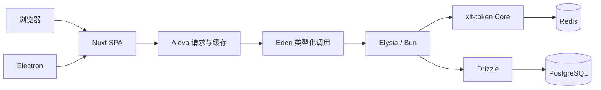

# 综合工作平台设计基线 v0.1

日期：2026-09-26。状态：讨论稿；明确标注的用户约束已确定，其余为本轮建议，尚未冻结为实现规范。

本文记录系统边界、授权语义和首个可验证闭环的设计建议。项目现已按“先打基础”的顺序建立目录骨架、Bun Workspaces 和 Turborepo 基础配置；当前实际结构见[根目录 README](../README.md)。目前已接入 Nuxt SPA、Elysia/Bun 和 Electron 的最小入口，仅实现 test 页面与接口；授权及业务实现尚未开始。

## 已确定的约束

- 前端采用 Nuxt SPA、Nuxt UI、Tailwind CSS；关闭 SSR，不使用 Nuxt 服务端业务能力。
- 浏览器和 Electron 共用前端代码，连接统一部署的 Elysia 后端。
- 后端运行在 Bun，使用 Drizzle、PostgreSQL、xlt-token Core 和 Redis。
- Eden 提供前后端调用契约；Alova 提供请求管理、缓存等能力，实际业务 API 请求委托 Eden。
- API 调用层放入 `packages/api-client`，独立于 UI 框架，便于以后替换前端；状态适配与应用初始化留在前端应用。
- 当前阶段聚焦用户、角色、资源、部门、会话和审计。
- Bun Workspaces + Turborepo 管理 monorepo。
- 单组织平台，不做多租户；权限通过角色授予，不建立用户直接授权关系。
- 统一资源树承载 M（目录）、C（页面）、F（操作，传统称按钮）。
- 保留六种角色数据范围，多角色采用允许范围的并集。

## 运行与依赖边界

| 部分 | 承担的职责 |
| --- | --- |
| Nuxt | 文件路由、布局、组件、自动导入、页面中间件、SPA 组织约定 |
| Nuxt UI / Tailwind | 组件与样式 |
| Electron | 窗口、托盘、系统集成、受控的本地能力 |
| Alova | 请求状态、去重、分页、缓存和失效 |
| Eden | 路径与入参类型、序列化、业务 API 网络调用、响应类型 |
| Elysia | HTTP 校验、认证和授权接入、业务服务 |
| xlt-token Core / Redis Store | Token 生命周期、会话、角色与权限检查的基础能力 |
| 平台授权模块 | 角色和资源模型、授权快照、数据范围计算、授权变更生效 |
| Drizzle / PostgreSQL | 业务数据、关系约束、事务和查询 |



Nuxt 配置 `ssr: false` 并生成静态产物，Web 静态服务器负责 SPA 路由回退，生产环境无需运行 Nuxt 业务服务器。构建阶段使用 Nuxt/Nitro 的工具链不等于部署 Nuxt 后端。[Nuxt 渲染模式](https://nuxt.com/docs/4.x/guide/concepts/rendering)

Electron 主进程使用 Electron 内置 Node.js，渲染进程使用 Chromium；Bun 不替换它们。Electron 打包同一份 SPA，建议通过受控自定义协议加载，并正确处理资源路径和路由回退。保持 `nodeIntegration: false`、`contextIsolation: true` 和沙箱；preload 只暴露具体能力，不暴露任意 IPC、文件读写或任意地址请求。[Electron 进程模型](https://www.electronjs.org/docs/latest/tutorial/process-model)、[安全指南](https://www.electronjs.org/docs/latest/tutorial/security)

目录按应用职责与需要独立复用的模块组织：

```text
apps/
  web/                   Nuxt SPA，业务界面与请求客户端初始化
  desktop/               Electron main / preload / 打包
  server/                完整 Elysia 后端：业务、授权、数据访问、Bun 启动
packages/
  api-client/            框架无关的 Eden + Alova 请求封装
  access-contract/       浏览器可用的权限标识、范围枚举等小型契约
  config/                共享 TypeScript / lint 配置
infra/                   本地 PostgreSQL / Redis 配置
docs/
```

`apps/server/src/modules` 按 auth、system、sessions、audit 划分模块；system 下放 users、roles、resources、departments。模块采用 Elysia 推荐的 `index.ts`（路由实例）、`service.ts`（业务服务）、`model.ts`（校验模型），按数据访问需求补充 `repository.ts`。数据库相关代码也放在后端应用内部；出现独立消费者后再考虑拆包。框架目录依据、项目自定义部分及初始化要求见[框架约定](framework-conventions.md)。

`apps/server/src/app.ts` 定义应用工厂，`src/index.ts` 负责启动监听，二者通过应用内分文件区分职责。`packages/api-client` 仅通过 `import type` 从 `@platform/server/types` 引用后端应用类型，前端不能运行时导入数据库、Redis、服务端凭证或后端环境配置。业务 DTO 从 Elysia schema/路由推导，不复制一套手写接口。

应用专用代码保留在对应应用内。浏览器和 Electron 共用同一个 Nuxt 前端；请求包通过 `createApi({ baseURL, statesHook })` 接收 API 地址与 Alova 状态适配器，便于换用其他前端框架。Nuxt 插件负责读取配置、传入 `VueHook` 和注入 `$api`；请求包不包含 UI 框架依赖、页面 Hook、路由或消息提示。`packages` 同时保留授权契约和共享开发配置。

每个包声明自己的任务，根脚本委托 `turbo run`。开发服务和数据库迁移不缓存；构建声明实际输出和影响产物的环境变量。桌面打包显式依赖 Web 静态构建。工作区结构依据 [Turborepo 文档](https://turborepo.dev/docs/crafting-your-repository/structuring-a-repository)。

## Eden 与 Alova 的组合

采用单向调用链：页面 → 业务请求工厂 → Alova Method → 自定义 request adapter → Eden Treaty → Elysia。

这是本项目拟实现的小型适配层，不是假定已有官方 Eden-Alova 集成。Alova 提供自定义适配入口，Eden 提供类型化请求及 Fetch 配置。[Alova request adapter](https://alova.js.org/tutorial/advanced/custom/http-adapter/)、[Eden 配置](https://elysiajs.com/eden/treaty/config)

请求工厂应保留具体 Eden 方法的参数和响应推导，不通过 `any` 或字符串反射调用抹掉契约。适配层只负责以下边界：

- 惰性执行 Eden 调用；缓存命中时不能提前发出网络请求。
- 将取消与超时传递到实际 Fetch 的 `AbortSignal`。
- 统一处理响应头及错误。Eden 默认可能返回包含 `error` 的结果对象，必须转换为 Alova 能感知的失败，不能把 401/403 当成成功缓存。[Eden 响应约定](https://elysiajs.com/eden/treaty/response)
- 每个 Method 的请求身份包含稳定的 endpoint 标识、HTTP 方法、规范化的 path/query/body，以及账号和授权版本命名空间。不能只按回调函数、方法名或裸 URL 区分请求。
- 身份发生变化时取消旧请求，并阻止已发出的旧响应回填新账号的状态和缓存。

建议默认关闭通用响应缓存，再对允许缓存的查询开启短期内存缓存。字典等低敏公共信息可单独采用持久化缓存；权限、角色授权页面和登录状态不进入持久化缓存。Alova 的缓存模式和 Method key 可配置，但账号隔离是项目自身需要实现的规则。[缓存模式](https://alova.js.org/tutorial/cache/mode/)、[Method key](https://alova.js.org/tutorial/advanced/in-depth/custom-method-key/)

写操作成功后，通过 `name` / `hitSource` 等机制失效相关读取缓存；可见列表的刷新另外显式触发，不能假设清除缓存会自动重发所有请求。认证失败不自动重试；非幂等写入不盲目重试。[自动失效](https://alova.js.org/tutorial/cache/auto-invalidate/)

## 统一资源模型与 Nuxt 路由

核心关系保留为：用户 ↔ 角色 ↔ 资源，角色另有数据范围和自定义部门集合。

建议表名使用 `sys_resource`，管理界面仍可叫“菜单管理”，不再建一张同义的权限表。

| 类型 | 语义 | 权限与路由规则 |
| --- | --- | --- |
| M | 导航目录 | `perms = null`，不因出现目录而授予任何业务操作 |
| C | 页面访问资源 | 绑定代码中已存在的 `route_name`，设置页面入口能力，如 `system:user:query` |
| F | 操作资源 | `perms` 必填，不参与路由；包括未表现为按钮的导出、批处理等操作 |

建议资源字段包含 `id`、`parent_id`、`type`、`name`、`route_name`、`perms`、`icon`、`sort_order`、`visible`、`enabled`。目录和操作资源不配置任意组件路径。

页面实现与文件路由由代码提供，后端返回的是可见导航和页面准入信息。Nuxt 页面通过 `definePageMeta` 声明所需权限，全局路由中间件完成准入检查。用户手输地址时仍检查权限；接口再次独立校验。页面资源的 `route_name` 只能引用受信任的路由清单，后端不能下发任意组件导入表达式。

这样仍然支持动态菜单、排序、隐藏和角色配置，同时保留 Nuxt 的文件路由约定。真正的可插拔远程页面不是首版需求。

建议明确以下行为：

- `visible = false` 只隐藏入口，不撤销授权。详情页可无侧边栏入口。
- `enabled = false` 表示资源不可授权使用；首版建议禁用目录/页面同时停用其子树，预览影响后提交。
- 构造导航可补齐目录祖先，但补齐祖先不产生页面或操作授权。
- C 页面授权不自动授予所有 F 操作；F 授权也不隐式授予父页面。角色编辑器可以帮助同时勾选，后端保存和校验仍采用显式授权。
- 树禁止循环、F 禁止有子节点，删除带授权引用的资源应拒绝或执行明确的受控迁移。
- 一个非空 `perms` 对应一个资源，设置唯一约束。同一能力可供多个接口或界面位置复用，不通过复制资源来复制权限。

权限标识由浏览器可用的代码契约定义并用于资源初始化。数据库管理启用状态、布局和角色授予关系；普通菜单编辑不能随意修改已发布权限标识。构建或迁移检查路由元数据、接口声明与资源清单是否一致。

普通角色首版只使用精确的三段式权限标识。`*:*:*` 只作为受保护的超级管理员特例。核对的 xlt-token Core 2.4.0 发布代码中，匹配遇到 `*` 分段会直接成功，因此不能把 `system:*:query` 误解成仅允许查询。[匹配实现](https://github.com/xiaoLangtou/xlt-token/blob/master/packages/core/src/perm/perm-pattern-match.ts)

## xlt-token 与声明式后端检查

采用 `@xlt-token/core`，搭配 `@xlt-token/store-redis` 和其支持的 Redis 客户端。Core 已提供实例化认证入口、会话和权限检查；平台仍负责密码校验、用户状态、角色资源关系及数据权限。[Core 实例契约](https://github.com/xiaoLangtou/xlt-token/blob/master/docs/guide/multi-instance-contract.md)、[Redis Store](https://github.com/xiaoLangtou/xlt-token/blob/master/docs/store-redis/index.md)

创建显式 `createXltInstance()`，在 Elysia 插件中把每次请求适配到 Core 的 `HttpContext`；将当前主体放在请求上下文，不在全局对象上设置“当前用户”。不长期复用某个用户的 `XltSession` 对象，其实例自身会缓存读到的数据。

Elysia 使用 macro / guard 表达声明式约束，无需引入 Java 风格反射装饰器。如下只是拟议接口，`access`、`dataPolicy` 为本项目待实现约定，并非 Elysia 自带选项：

```ts
.get('/users', handler, {
  access: { permission: 'system:user:query' },
  dataPolicy: 'systemUser',
})
```

宏解析登录态、检查授权快照版本、校验权限并建立请求级授权上下文。`dataPolicy` 声明选择哪种数据归属模型，实际过滤条件由 repository 执行。只有声明而没有进入查询不算完成数据授权。[Elysia macro](https://elysiajs.com/patterns/macro)

路由必须属于显式公开、仅需登录、需要业务权限三类之一；未声明时默认拒绝，构建检查遗漏。仅需登录用于当前用户资料等个人接口，业务管理接口仍逐项授权。错误映射使用真实 HTTP 401/403 等状态，并保证 Eden 能推导对应响应。

授权快照保留最少且必要的信息：主体 ID/部门、角色 ID/标识、每个角色的权限与数据范围、自定义部门 ID、版本信息。扁平的 `permissions` 集合可以从同一快照派生，用于接口能力检查及前端显隐；不能丢掉“这项权限来自哪个角色”。

菜单树可独立生成和缓存，不必每次请求从 Session 读取整棵菜单、完整角色对象和巨大的后代部门列表。不在 Session 中保存 SQL 字符串或数据库表别名。

`getSession(loginId)` 是账号维度的扩展会话，不能误当作每个设备独占的状态容器。共同授权快照可以放入其中；设备凭证和设备状态另行处理。[权限与会话](https://github.com/xiaoLangtou/xlt-token/blob/master/docs/core/permissions-and-session.md)

平台已经缓存授权快照时，建议 `permCacheTimeout: 0`，使 `StpInterface` 从受版本控制的快照取得权限，避免叠加另一份有独立 TTL 的权限缓存。这不意味着每次查询 PostgreSQL；常规命中仍走 Redis。[权限缓存实现](https://github.com/xiaoLangtou/xlt-token/blob/master/packages/core/src/auth/stp-perm-logic.ts)

## 数据范围：先筛选授权角色，再合并范围

对具体操作 p，计算该用户仍有效且实际授予 p 的角色集合 `R(u, p)`。先检查 p 的能力，再在该角色集合中对数据范围取 OR。

```text
允许访问记录 = 存在 r ∈ R(u, p)，使记录属于 scope(r)

查询条件 = 业务筛选 AND (scope(r1) OR scope(r2) OR ...)
```

如果角色 A 授予“订单查询 + 仅本人”，角色 B 授予“公告管理 + 全部数据”，订单查询仍只能访问本人订单。角色 B 没有授予订单查询，不能把“全部数据”贡献给订单查询。

因此不能先把用户所有角色的数据范围压成一个全局范围。若今后同一人需在某模块查全部、在另一模块只查本部门，首版通过不同角色组合表达；真正出现大量重复角色后再考虑角色与资源上的范围覆盖。

| 值 | 范围 | 对单个已授予当前操作的角色生成的条件 |
| --- | --- | --- |
| 1 | 全部数据 | 不添加该模块的数据范围限制；仍保留业务筛选 |
| 2 | 自定义部门 | 记录归属部门属于该角色显式选择的部门集合 |
| 3 | 本部门 | 记录归属部门等于主体当前部门 |
| 4 | 本部门及以下 | 记录归属部门属于主体当前部门及其后代 |
| 5 | 仅本人 | 记录所有者等于主体用户 |
| 6 | 部门及以下或本人 | 条件 4 OR 条件 5 |

首版建议一个用户至多属于一个部门，此项待数据模型阶段确认。范围 2 只匹配显式选中的部门，不隐式包含其后代。无部门时部门分支为 false，范围 6 的本人分支仍可成立。空自定义部门集合为 false；未知范围拒绝访问。

每个业务模块显式定义“所有者”和“归属部门”的字段。例如用户管理中的“本人”对应 `sys_user.id`，不能错误地用 `created_by`。业务记录的所有者、创建人和负责人不必是同一个概念。人员调部门是否改变旧业务记录归属，需要按业务决定，不能通过用户关联查询悄悄改变历史数据。

建议用受限 repository + 统一 Drizzle 条件构造器。构造器返回明确的 `all / none / predicate` 结果，组合为单次 `.where(and(...))`，禁止将缺失映射当成无限制查询。Drizzle 的动态查询能力不意味着多次 `.where()` 自动 AND 合并。[动态查询说明](https://orm.drizzle.team/docs/dynamic-query-building)

应用覆盖面必须包括列表、总数、详情、联表、统计、导出，以及更新/删除和批量写入。写操作将数据范围与 ID 条件一并放进 SQL，不能只在写之前单独查一次。新增和转移归属还须验证目标部门/所有者，不能只验证旧记录。

业务服务通过 repository 访问受保护数据，原始数据库连接留在受限基础设施边界。复杂联表明确过滤哪一侧；批处理和后台任务也必须提供主体或显式受控的系统身份。

首版不实现解析任意 SQL 后重写的拦截器。PostgreSQL RLS 可在后续作为额外防线，但需要明确数据库角色、连接池中的请求身份传递及事务边界，并验证表所有者/特权角色的绕过行为。[PostgreSQL RLS](https://www.postgresql.org/docs/current/ddl-rowsecurity.html)

## 权限变更、缓存与超级管理员

三类状态分别管理：PostgreSQL 中的授权事实、Redis 中的登录态/授权快照、Alova 中的前端响应缓存。Redis 是运行时存储，授权配置的事实来源仍是 PostgreSQL；Redis 是否开启 AOF/RDB 是部署选择，不能把“使用 Redis”等同于已保证持久化。

建议第一版用用户版本和全局授权策略版本。用户状态/部门/角色绑定变更更新用户版本；角色权限/范围、资源启用状态和部门树变更更新全局策略版本。起步时全局版本比维护大量角色到用户的反向失效索引更简单，规模上来后再细化。

每次受保护请求通过可信的服务端版本检查快照；过期时重新构建，重建必须有并发保护并阻止旧版本覆盖新版本。快照缺失或 Redis 失效时，不允许把旧权限当作兜底。前端收到新版本、401/403 或恢复应用焦点时按约定重新校验登录/授权状态，必要时清理业务缓存和已显示的数据。

客户端传回的版本只能帮助识别显示是否过期，不能成为后端授权依据。客户端缓存无法撤回已经交付的数据，服务端拒绝新访问与界面更新是不同保证。

撤权生效契约建议定义为：管理操作对外确认“已生效”之后到达的新请求，不再使用旧授权。PostgreSQL 提交和 Redis 更新不是一个原子事务，不能仅靠先写库再删缓存宣称达成该契约。下一阶段需要落实变更期间的拒绝访问标记、可靠的变更记录/重试、单调版本发布和失败恢复。单靠 TTL 或发布订阅通知不足以保证撤权。

已经通过授权的在途请求另有边界：普通读取可能完成；敏感写入若要求同时撤销，需在提交附近增加版本/锁约束。该要求应在实现授权变更流程时明确，并形成并发测试。

超级管理员建议通过受保护的系统角色绑定识别，集中在一个授权入口处理。可对外表示为 `*:*:*` 并取得全部数据范围；普通资源和角色编辑不能创建该通配授权。最高授权不跳过登录有效性、账号禁用、请求校验、业务状态规则及审计，也不移除软删除等业务过滤。

首版建议仅超级管理员修改资源授权、角色数据范围和用户角色绑定，普通用户管理接口只编辑允许的资料字段。若以后增加委派管理员，需要独立设计“可以授予哪些权限与范围”，不能把能编辑用户或角色等同于能授予任意权限。

## 首批数据实体

| 表 | 主要内容 |
| --- | --- |
| `sys_user` | 身份、凭证摘要、状态、部门、授权版本 |
| `sys_role` | 角色标识、状态、数据范围、系统保护标记 |
| `sys_resource` | 统一 M/C/F 资源树、权限标识和导航属性 |
| `sys_user_role` | 用户与角色的关联，联合唯一 |
| `sys_role_resource` | 角色与资源的关联，联合唯一 |
| `sys_department` | 部门树，父子关系和状态 |
| `sys_role_department` | 范围 2 的角色与部门关联，联合唯一 |
| `sys_audit_log` | 登录、权限调整、敏感业务操作的审计 |

另外需要授权策略版本和可靠变更记录的存储；在授权变更协议明确后定字段。部门树首版可使用父子邻接关系与递归查询，不急于增加多套层级冗余结构。

## 浏览器与桌面的认证传输

部署方式已确定，但凭证传输与“记住登录”策略尚未冻结。建议 Web 采用同源反向代理 `/api`；这不改变前后端独立部署。

浏览器优先评估 HttpOnly / Secure Cookie，并明确 SameSite、Origin/CSRF 校验和注销清理。Electron 打包后的自定义协议来源与 Web 站点不同，不能直接假设沿用相同 Cookie 跨站行为；桌面可评估 Bearer 会话和主进程受控凭证存储。

长期凭证不直接存进渲染层 localStorage。需要保持登录时，桌面主进程仅对固定后端来源使用凭证，preload 不提供任意地址带凭证请求。首个桌面联调阶段验证来源、CORS、Cookie/Bearer、深链刷新及注销，之后固定跨端凭证契约。

## 分阶段推进与验收

1. 目录基础：建立应用、内部包、功能模块、基础设施的位置与职责，配置 Bun Workspaces、Turborepo 和公共开发配置；已完成。
2. 应用初始化：接入 Nuxt SPA、Elysia/Bun、Electron 的最小入口与实际构建，锁定框架依赖并验证工作区边界；目前已完成 test 范围的最小运行与构建。
3. 模型与认证：明确资源树行为、权限命名、单部门假设、角色范围组合和撤权生效契约，再实现 Drizzle schema、迁移、xlt-token/Redis 及登录闭环。
4. 一个完整授权用例：用户查询与修改 → 资源/角色分配 → 菜单与按钮 → Elysia 接口检查 → Drizzle 数据范围 → Alova 失效。
5. 扩展平台能力：部门、审计与在线会话；桌面壳在应用初始化阶段早期联调，打包与分发在此阶段完善。

首个用例的关键验证应包括：

- 无权限直接调用 API 返回拒绝，隐藏按钮不能替代接口检查。
- 六种数据范围、多个相关角色 OR，以及无关“全部数据”角色不扩大当前操作范围。
- 列表、count、详情、导出和更新/删除使用一致授权边界，空范围不会漏成全量。
- 对旧记录有编辑权限但无目标归属权限时，转移记录失败。
- 撤权、调部门、禁用账号后旧会话不能持续使用旧权限；并发快照重建不会恢复旧授权。
- Alova 缓存命中不执行 Eden，网络错误和 Eden error 被视为失败，abort 到达实际网络调用。
- 用户 A 退出后用户 B 不会看见 A 的缓存或旧请求返回的数据。
- 浏览器与 Electron 使用同一 API 契约，生产 SPA 深链接可正常打开。

本轮已核对官方文档与 xlt-token Core 2.4.0 的发布包接口/关键实现；现已验证 test 用例在 Bun、Nuxt 和 Electron 下的最小运行，xlt-token 与数据库组合仍未接入。适配层原型与上述用例通过后，再将对应建议升级为正式约定。
